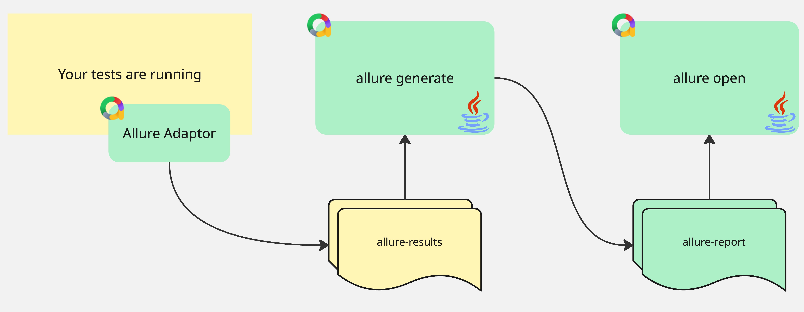
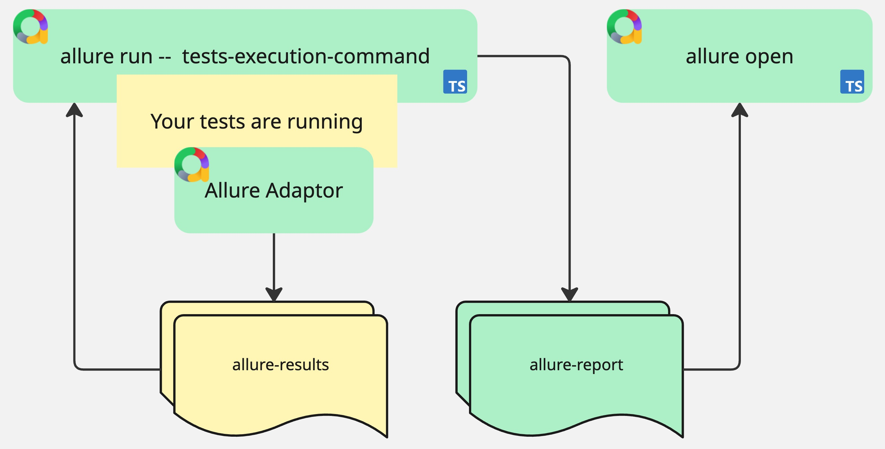

# Dramatic changes

1. Java is no longer required.
2. BE and FE tasks are written using TS.  
3. Report now can be generated when tests are running.

## Allure2 workflow

## Allure3 workflow

[back](./!toc.md)